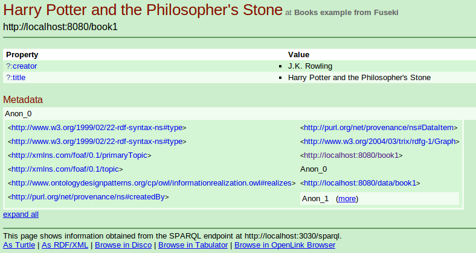

# LIFE SCIENCES LINKED DATA (LSLD)

## INTRODUCTION

This is a standalone, light-weight, configuration-free bundle to publish information as [Linked Data](http://www.w3.org/standards/semanticweb/data). It is meant as an educational tool that students can use to become familiar with Linked Data, by publishing their own dataset at localhost with only the necessary hassle, but still being aware of the overal technical setting. It can also be used for rapid prototyping and deployment of a Linked Data system. 

The bundle is comprised of:

- [Jena-Fuseki](http://jena.apache.org/documentation/serving_data/index.html) as a triple store.
- [Jetty](http://jetty.codehaus.org/jetty/) as a web server.
- [Pubby](http://wifo5-03.informatik.uni-mannheim.de/pubby/) for the actual Linked Data magic. 


Pubby is already configured to work with one of the example datasets included in Jena-Fuseki. Jetty includes Pubby as a web application and it is configured accordingly (Look at `jetty-distribution-9.0.0.M3/webapps/ROOT/WEB-INF/books-config-file.ttl` and `jetty-distribution-9.0.0.M3/webapps/ROOT/WEB-INF/web.xml`). Note that the directory `pubby-0.3.3` is included only for completeness, since Pubby is already installed as a web application within Jetty.

The pack is meant to work in a GNU/Linux system and it needs Java, Ruby, and cURL to be installed. The user should have basic knowledge on Unix, HTTP, [RDF](http://www.w3.org/standards/techs/rdf), [OWL](http://www.w3.org/standards/techs/owl), and [SPARQL](http://www.w3.org/standards/techs/sparql). 

## RUNNING WITH THE DEFAULT DATASET

This section shows how to run the pack out of the box, with the example dataset included in Jena-Fuseki, and the configuration for it (The already mentioned `web.xml` and `books-config-file.ttl`). See bellow to use a different dataset and configuration.

Move to `/jena-fuseki-0.2.6-SNAPSHOT` and make Jena-Fuseki executable:

`chmod +x fuseki-server s-*`

Run Jena-Fuseki:

`./fuseki-server --update --mem /ds`

In another terminal, load data:

`./s-put http://localhost:3030/ds/data default Data/books.ttl`

Test that data has been loaded:

`./s-query --service http://localhost:3030/ds/query 'SELECT * {?s ?p ?o}'`

Should return a chunk starting like this:

```
{
  "head": {
    "vars": [ "s" , "p" , "o" ]
  } ,
  "results": {
    "bindings": [
      {
        "s": { "type": "uri" , "value": "http://example.org/book/book5" } ,
        "p": { "type": "uri" , "value": "http://purl.org/dc/elements/1.1/title" } ,
        "o": { "type": "literal" , "value": "Harry Potter and the Order of the Phoenix" }
      } ,
```

To test on the web, go to (http://localhost:3030/sparql.html) and execute `SELECT * {?s ?p ?o}` (target graph `http://localhost:3030/books.ttl`). It should return a similar chunk.

Move to `/jetty-distribution-9.0.0.M3` and run jetty:

`java -jar start.jar jetty.port=8080`

Test the whole setup by opening [http://localhost:8080/book1](http://localhost:8080/book1) in a browser: there should be a webpage with clickable links.



## RUNNING WITH A DIFFERENT DATASET

A Life Sciences toy dataset, including links to other datasets of the [Linked Open Data cloud](http://lod-cloud.net/), is available at `jena-fuseki-0.2.6-SNAPSHOT/Data/LSLD_example.owl`.

This time we will run fuseki [differently](http://answers.semanticweb.com/questions/9660/fuseki-gives-405-error-during-s-put). Move to `/jena-fuseki-0.2.6-SNAPSHOT`, making sure that, if you have been running the pack with the default dataset, both fuseki and jetty have been killed: 

`mkdir lslddb`

`./fuseki-server --update --loc=./lslddb /dataset`

In another terminal, upload the dataset:

`./s-put http://localhost:3030/dataset/data lsld Data/LSLD_example.owl`

A pubby configuration file is already set at `jetty-distribution-9.0.0.M3/webapps/ROOT/WEB-INF/lsld-toy-config-file.ttl`, edit `web.xml` in the same directory to load the pubby configuration file by commenting out the prior configuration files:

```
  <context-param>
    <param-name>config-file</param-name>
    <param-value>lsld-toy-config-file.ttl</param-value>
<!--<param-value>books-config-file.ttl</param-value> -->
<!--<param-value>config.ttl</param-value> -->
  </context-param>
```
  
In another terminal, run jetty:

`java -jar start.jar jetty.port=8080`

Test the whole setup by opening [http://localhost:8080/Protein_A](http://localhost:8080/Protein_A) in a browser: there should be a webpage with clickable links. Some of the links point to other resources within the dataset and some point to external Linked Data resources.


## TESTING CONTENT NEGOTIATION

We can test and debug [content negotiation with cURL](http://richard.cyganiak.de/blog/2007/02/debugging-semantic-web-sites-with-curl/). We first simulate to be a web browser, i.e. we need an HTML representation of the data for human consumption, so we invoke cURL in a terminal:

`curl http://localhost:8080/Protein_A`

We obtain: 

`303 See Other: For a description of this item, see http://localhost:8080/page/Protein_A`

The HTTP 303 redirects us to http://localhost:8080/page/Protein_A:

`curl http://localhost:8080/page/Protein_A` 

And we obtain an HTML page.

We can simulate to be an automatic agent that consumes pure RDF:

`curl -H "Accept: application/rdf+xml" http://localhost:8080/Protein_A`

We obtain: 

`303 See Other: For a description of this item, see http://localhost:8080/data/Protein_A`

The HTTP 303 redirects us to http://localhost:8080/data/Protein_A:

`curl http://localhost:8080/data/Protein_A` 

And we obtain an RDF dataset. The agent can follow the links on such dataset and content negotiation will happen again in the links it visits.

## MOVING TO A PRODUCTION SYSTEM

No security nor performance requirements have been taken into account when building this pack. In order to implement a Linked Data system, you would need to thoroughly improve the Pubby configuration file, most importantly the SPARL endpoint and the mapping from external to internal URIs, and use production level systems in the triple store and web server parts. Also, content negotiation can be done in different ways (http://linkeddatabook.com/editions/1.0/#htoc11).

## ABOUT

This work is funded the Marie Curie program of the EU and is a project of the Biological Informatics Group of the Centre for Biotechnology and Plant Genomics of the UPM, Spain (http://wilkinsonlab.info). Any questions should be directed to mikel.egana.aranguren@gmail.com. Also please feel free to open issues and fork/request pulls at will.

